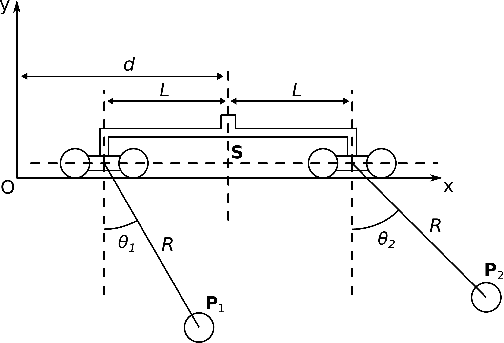
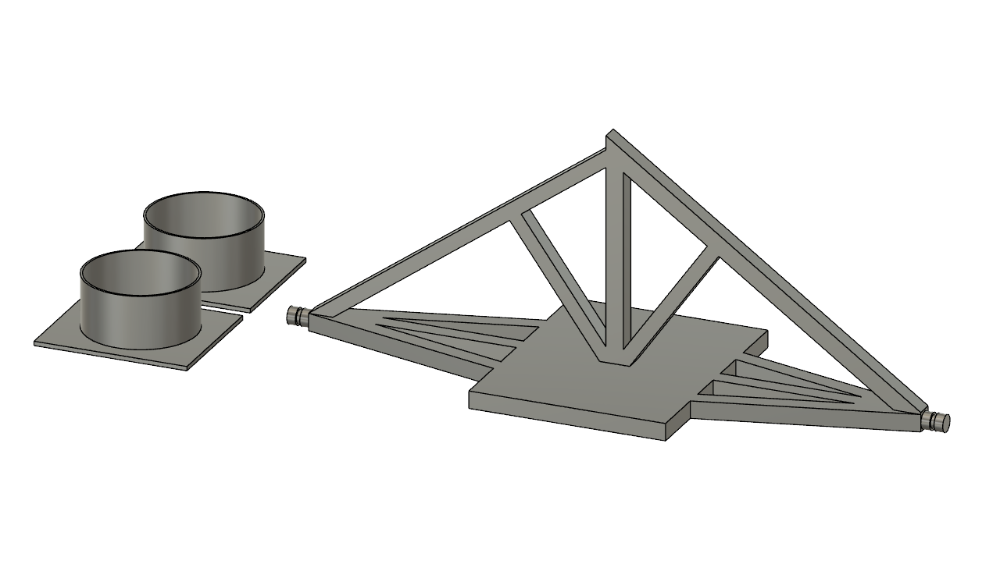
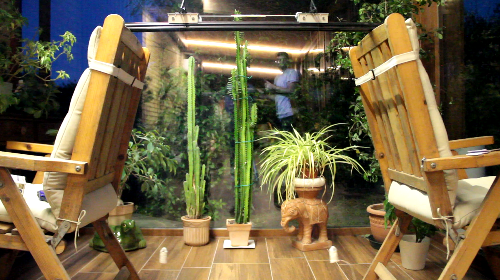
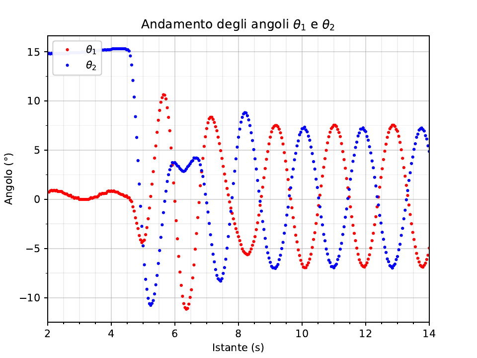
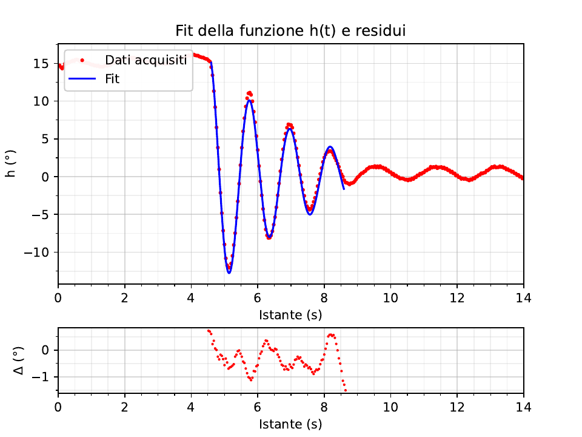
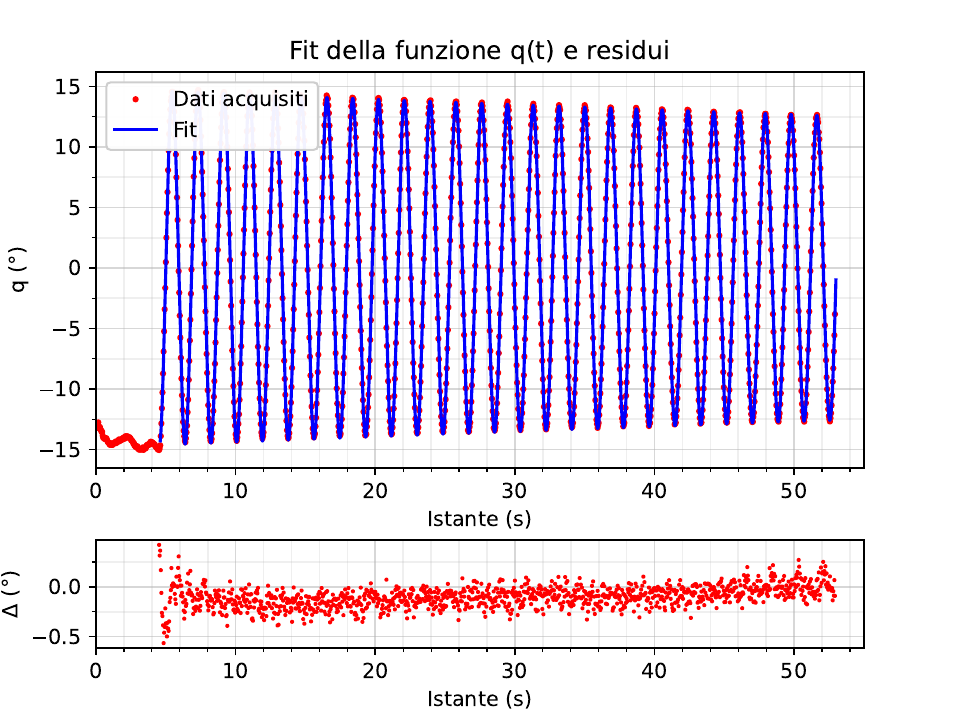

# Sincronizzazione di due pendoli accoppiati

In questa repository è presente il materiale prodotto per l'esame di Sistemi Complessi della triennale in fisica di Bologna. L'oggetto dello studio è il fenomeno di sincronizzazione tra due pendoli accoppiati tramite un'asta.
Di seguito è presentato un breve riassunto del lavoro effettuato; una descrizone completa è presente in .

## Analisi meccanica del moto di due pendoli accoppiati

  

Senza considerare attriti, dalla figura si calcola la lagrangiana del sistema, a meno di costanti, come

$$
\mathcal{L}_{PO} =  \left(m+ \frac{M}{2}\right) \dot{d}^2 + \frac{m R^2}{2}  (\dot\theta_1^2 + \dot\theta_2^2) + m \dot{d} R (\dot \theta_1 + \dot \theta_2) - \frac{m gR}{2} (\theta_1^2 + \theta_2^2) .
$$

## Equazioni del moto in assenza di attrito

Per proseguire è necessario approssimare la lagrangiana nel regime di piccole oscillazioni e sfruttare un cambio di coordinate per gli angoli: 

$$\begin{array}{c}
h = \theta_1 + \theta_2 , \\
q = \theta_1 - \theta_2.
\end{array}
$$

E' possibile utilizzare ora un'altra funzione, la funzione di Routh, per poter eliminare un grado di libertà. Si ottiene immediatamente

  

Si può così completamente ricostruire il moto del sistema. Si nota che, partendo da una situazione iniziale arbitraria, la condizione di sincronizzazione in fase equivale alla richiesta che q tenda a zero, mentre quella in controfase equivale alla richiesta che h tenda a zero. Occorre fare attenzione al fatto
che però nella soluzione dell'equazione il moto evidentemente non può convergere, essendo hamiltoniano, ad una soluzione particolare, fatta eccezione per alcune condizioni iniziali patologiche.

## Equazioni del moto in presenza di attrito

Affinchè il moto converga ad una soluzione particolare, come accade nella realtà, è necessario tenere conto dei fenomeni dissipativi. Potrebbe ad esempio essere considerato l'attrito che si sviluppa nel perno dei pendoli, quello generato dal movimento delle ruote dei carrelli, sia radente che volvente, e quello tra l'aria e le varie componenti mobili. Si supponga di voler includere nelle equazioni del moto un termine proporzionale alle velocità angolari , con costante comune di proporzionalità gamma, avente le dimensioni di una frequenza. Riscrivendo le equazioni del moto e aggiugnendo alle forze generalizzate l'attrito citato sopra si ottengono due equazioni

  

Dopo qualche sostituzione, sfruttando la coordinata ciclica d si possono riscrivere le due equazioni con le nuove variabili.  La considerazione decisiva per osservare il fenomeno della sincronizzazione consiste nel considerare la costante gamma diversa per i due modi di oscillazione; differenziando le nuove costanti
con un pedice, si tiene conto di effetti dissipativi che influenzano in modo differente il modo di oscillazione in fase rispetto a quello in controfase.  È evidente quindi che se le costanti gamma sono diverse, l'ampiezza di uno di questi due modi va a zero più velocemente rispetto all'altro, sincronizzando il moto. In conclusione le equazioni considerate sono:

 
  

# Apparato sperimentale

## Materiale utilizzato

Riferirsi a .

## Realizzazione pratica del modello

Inizialmente la realizzazione del progetto era stata pensata tramite una rotaia a cuscino d'aria, per poter studiare il fenomeno, nella sua parte transiente, per un periodo di tempo lungo, grazie al poco attrito; questa idea però è stata abbandonata dopo alcuni tentativi per le numerose difficoltà sperimentali. Successivamente si è provato ad usare delle costruzioni giocattolo per la creazione di una rotaia e carrellini; purtroppo anche questo tentativo è stato accantonato a causa di notevoli imperfezioni e mancanza di allineamento tra i vari pezzi di rotaia.

In seguito si è pensato quindi di utilizzare un'altro tipo di rotaia di laboratorio, dotata di carrellini con ruote. La progettazione del modello si è rivolta, una volta recuperata l'apparecchiatura di laboratorio, alla costruzione dei supporti, disegnati tramite un software di modellizzazione tridimensionale e stampati con una stampante 3D. 

  

L'apparato sperimentale completo è mostrato nella figura seguente:

  

## Esecuzione dell'esperimento

Una volta sistemati tutti gli elementi, sono stati acquisiti differenti video del fenomeno, avendo la cura di avere una condizione iniziale statica, con i tutti gli elementi fermi rispetto al sistema di riferimento della stanza. Questa ipotesi è stata  realizzata inizialmente collegando, dopo aver fermato il pendolo di sinistra, con un lungo spago fatto circolare attorno all'apparato, il pendolo e il carrello di destra. In questo modo si puntava ad eliminare l'errore dato dalla non coincidenza degli istanti di rilascio dei due elementi, che sarebbero invece stati messi in moto nello stesso momento al taglio dello spago. Questo sistema, però, è risultato inadatto in quanto lo spago, una volta tagliato, continuava a disturbare il movimento dell'apparecchio introducendo un nuovo attrito e distorcendo il fenomeno. Si è provato quindi ad agire nel modo più semplice: fermando il pendolo di sinistra, trattenendo con una mano il carrellino di destra e con l'altra lo spago collegato al rispettivo pendolo. 

## Scrittura dei programmi per l'acquisizione e l'elaborazione dati

Per quanto riguarda la scrittura dei programmi, si è scelto di utilizzare la libreria [OpenCV](https://opencv.org/), una libreria open source utilizzabile in particolare nel linguaggio di programmazione C++, destinata all'analisi di immagini e video. In questo esperimento la libreria è stata utilizzata nel per tracciare il movimento nel tempo dei pendoli e dei carrellini, in maniera automatizzata. E' stato utilizzato il C++ per la nota velocità in esecuzione rispetto a python. 

# Risultati e discussione

Il grafico degli angoli al trascorrere del tempo è mostrato nella figura seguente.

  

Si nota come, dopo un breve periodo iniziale di quiete, in cui il pendolo 1 si trova in quiete, mentre il pendolo 2 descrive piccole oscillazioni dell'ampiezza di circa 1°, che si è cercato di ridurre il più possibile manualmente, il sistema viene lasciato libero di evolvere. Dopo un momento di transizione, in cui i pendoli e i carrellini descrivono il loro complicato moto, circa dall'istante 4.6 all'istante 8.5, il sistema mantiene il suo moto nella condizione di oscillazioni in controfase, quindi con i carrellini necessariamente fermi, per la conservazione della quantità di moto iniziale, nulla.

Possono quindi essere costruite e analizzate le variabili h e q mostrate al variare del tempo:

  

  

In queste due figure sono anche presenti i due fit delle equazioni teoriche che dovrebbero regolare il moto delle due variabili; in basso sono mostrati anche i residui, ossia la differenza, calcolata punto per punto, tra i valori del fit e quelli dei punti acquisiti.

# Conclusioni

In conclusione, è stata osservata con successo la sincronizzazione di due pendoli, ossia la diminuzione dell'ampiezza a zero di un modo normale di oscillazione del sistema, fatto dovuto a differenti tassi di dissipazione di energia nei due modi appena citati. I due coefficienti gamma sono stati stimati essere pari rispettivamente a
0.77 ± 0.02 Hz per il modo in fase e 0.00631 ± 0.00006 Hz per quello in controfase.
Notiamo infine che la stima dei coefficienti di attrito data dal fit è in accordo con l'idea intuitiva legata alla caratteristica del modo di oscillazione in cui il carrello è fermo, ossia alla minor dissipazione di energia rispetto a quello in cui il carrello oscilla in opposizione di fase rispetto ai pendoli; ciò è dovuto soprattutto al maggiore attrito generato durante lo scorrimento sulla rotaia che si somma al normale attrito generato sul perno dalle oscillazioni dei pendoli. Questa sorgente di attrito è circa di 2 ordini di grandezza superiore rispetto all'altra.

